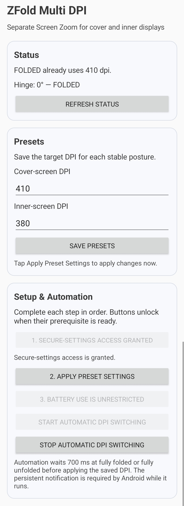

# ZFold Multi DPI

An Android utility for Samsung Galaxy Z Fold devices that applies separate Screen Zoom / DPI presets for the cover and inner displays.

## What it does

- Stores a DPI preset for each stable fold posture.
- Detects the hinge state locally.
- Applies the selected DPI through WindowManager after a one-time Shizuku-assisted secure-settings grant.
- Runs automatic switching as a visible foreground service and can restore it after reboot when enabled.

## Setup

1. Install the latest APK from [Releases](https://github.com/balamurugan15/ZFold-Multi-DPI/releases).
2. Start Shizuku and grant secure-settings access once from the app.
3. Save the cover and inner presets, then tap **Apply Preset Settings** to apply a preset immediately.
4. Start automatic DPI switching.

Shizuku is only required for the initial permission grant. Automatic switching uses the retained `WRITE_SECURE_SETTINGS` permission afterward.

## Notes

- The monitor uses a foreground-service notification while enabled, as required by Android.
- Set battery usage to **Unrestricted** for best reliability on Samsung devices.
- Density changes can make the UI difficult to use; begin with values close to Samsung's defaults.
